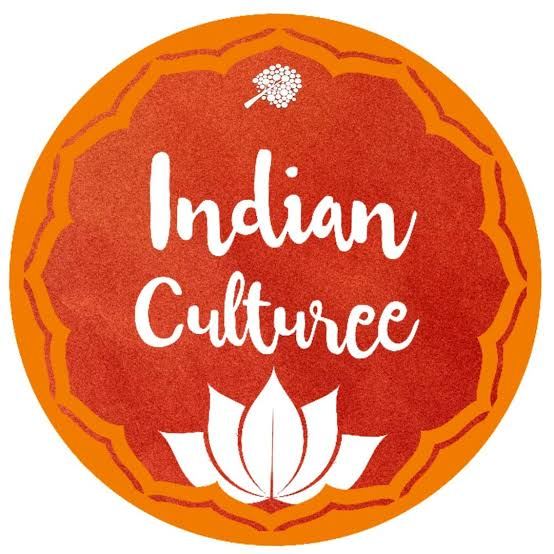

## Academic Project 
**Project Title:** Indian culture and Heritage

#  Indian culture and Heritage

  

## Project Overview
India is a country known for its rich and diverse culture and heritage, developed over thousands of years. Indian culture reflects a combination of ancient traditions, different religions, languages, customs, art forms, and ways of life. This project explores the major aspects of India's cultural and historical heritage.

## Objectives
- To showcase Indian culture and heritage.
- To promote awareness of Indian traditions.
- To highlight festivals, art, music, and dance.
- To explore India’s historical monuments.
- To preserve and promote cultural heritage.
- To celebrate India’s unity in diversity.

## Features
- Home Page
- Art & Music Page
- Culture and Food Page
- Gallery Page
- Heritage Site Page
- Indian-Festival Page
- Indian-History Page
- Religion & Spirituality Page
- Tradition & Lifestyle Page

## Technologies Used
- HTML5
- CSS

## Conclusion
Indian culture and heritage represent the unity and diversity of India. While different regions have their own languages, traditions, foods, clothing, arts, and festivals, these differences form an important part of India's shared cultural identity. Studying and preserving this heritage helps future generations understand India's history and appreciate its cultural diversity.

---

Made with [contrib.rocks](https://contrib.rocks).